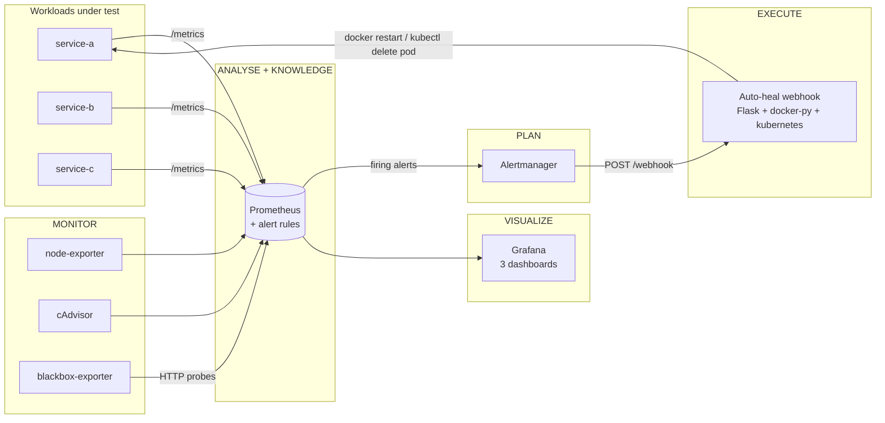

# Cloud-Native Auto-Healing Monitoring System

> A self-healing observability stack implementing the **MAPE-K** reference model
> (Monitor → Analyse → Plan → Execute → Knowledge) using open-source components
> only. Detects faults in containerized workloads via Prometheus alert rules and
> automatically remediates them through a Python webhook that can act against
> either the Docker API or the Kubernetes API.

[](LICENSE)
[](https://www.docker.com/)
[](https://prometheus.io/)
[](https://grafana.com/)
[](https://www.python.org/)
[](https://kubernetes.io/)
[](https://www.terraform.io/)


---

## Why this exists

Modern containerized systems fail in well-understood ways: containers crash,
memory leaks, CPU pins, probes time out, dependencies go down. Each of those
failure modes has a textbook remediation, yet most teams still wake a human
at 3 a.m. to run it.

This project closes that loop. Prometheus detects the fault, Alertmanager
routes it, a small Python webhook executes the correct action, and the system
is healthy again before anyone notices. **One minute from kill to recovery,
no human in the loop.**

Built as the M.E. Computer Engineering mini project at GTU (defended
2026-05-16). The architecture deliberately uses raw Prometheus + Alertmanager
+ a custom webhook rather than the Prometheus Operator so the MAPE-K control
loop is visible end-to-end, which is the academic contribution.

---

## At a glance

- **5 fault scenarios** detected and remediated automatically (`S1`–`S5`).
- **~52 second MTTR** for the alert-pipeline path, measured under load.
- **Hybrid Docker + Kubernetes** architecture — the same webhook routes to
  the right API based on an alert label.
- **3 Grafana dashboards** provisioned automatically.
- **22+ unit tests** covering dispatch, payload parsing, audit logging.
- **5-scenario evaluation harness** with smoke / pilot / full modes.
- **Optional cloud track** — single GCP `e2-medium` VM via Terraform,
  ~$0.034/hr.
- All open-source. All version-pinned. No `:latest` tags.

---

## Architecture



The five MAPE-K stages map one-to-one onto the container set. Every arrow
is observable in Grafana, every action is recorded in the webhook's
structured JSON audit log.

---

## The five fault scenarios

| ID  | Alert            | Detection rule                                                                                | Remediation        | Demonstrates           |
|-----|------------------|-----------------------------------------------------------------------------------------------|--------------------|------------------------|
| S1  | ContainerDown    | `up{job="demo-services"} == 0` for 30s                                                        | restart_container  | Full webhook auto-heal |
| S2  | HighMemory       | `process_resident_memory_bytes{job="demo-services"} > 230 MiB` for 30s                        | scale_out          | OOM safety net         |
| S3  | HighCPU          | `rate(process_cpu_seconds_total{job="demo-services"}[1m]) > 0.95` for 1m                      | scale_out          | CPU exhaustion         |
| S4  | ProbeFailing     | `probe_success{job="blackbox-http"} == 0` for 30s                                             | restart_container  | Synthetic probe        |
| S5  | DependencyDown   | `sum by (service) (rate(http_requests_total{code=~"5.."}[1m])) > 1` for 1m                    | capture_snapshot   | Cascade failure        |

Each alert emits an `autoheal_action` label that keys into the webhook's
dispatch table. The webhook's `environment` label (`docker` or
`kubernetes`) selects which API to act against.

---

## Live demo (under 60 seconds)

With the stack running:

```powershell
docker kill service-a
```

| Time   | What you see in Grafana                                      |
|--------|--------------------------------------------------------------|
| t=0s   | Container killed                                             |
| t=10s  | `service-a` liveness flips to **DOWN** in red                |
| t=40s  | `ContainerDown` alert reaches **firing** state               |
| t=55s  | Webhook restarts the container — restart counter goes 0 → 1  |
| t=57s  | `service-a` liveness back to **UP** in green                 |

Or use the bundled `make` target which scripts the whole thing:

```powershell
./make.ps1 demo
```

---

## Quick start (Windows 11 + Docker Desktop)

```powershell
# One-time PowerShell setup (only if you have never run a .ps1 script before)
Set-ExecutionPolicy -Scope CurrentUser -ExecutionPolicy RemoteSigned

# Clone and start the stack
git clone https://github.com/VedantDomadiya/cloud-native-auto-healing-monitoring-system.git
cd cloud-native-auto-healing-monitoring-system
Copy-Item .env.example .env
./make.ps1 up

# Run the smoke evaluation (5 scenarios, ~10 minutes)
./make.ps1 evaluate-smoke
python evaluation/analyze_results.py

# Stop cleanly
./make.ps1 down
```

Linux / WSL users have the equivalent `Makefile`.

After `make.ps1 up`, open:

| Endpoint            | URL                                    | Credentials   |
|---------------------|----------------------------------------|---------------|
| Grafana             | http://localhost:3000                  | admin / admin |
| Prometheus          | http://localhost:9090                  | none          |
| Alertmanager        | http://localhost:9093                  | none          |
| cAdvisor            | http://localhost:8080                  | none          |
| Webhook /healthz    | http://localhost:5000/healthz          | none          |
| service-a / b / c   | http://localhost:8001 / 8002 / 8003    | none          |

See [SETUP.md](SETUP.md) for prerequisites, troubleshooting, and the
Kubernetes / cloud install paths.

---

## Dashboards

### Container Summary — the star of the demo

Real-time service CPU, memory, liveness, restart counter, and active
alerts in one view.


### Host Overview

`node-exporter` host metrics with stat panels for current CPU, memory,
and load average plus per-core timeseries.


### Application Performance

`http_requests_total` and `http_request_duration_seconds` from each
demo service: request rate, error rate, p50/p95/p99 latency.


---

## Evaluation results

Smoke run, 5 scenarios, 1 run each. Full interpretation in
[`evaluation/results/report.md`](evaluation/results/report.md).

| ID  | Scenario     | MTTR (s) | Outcome    |
|-----|--------------|----------|------------|
| S1  | docker_kill  | 52.34    | recovered  |
| S2  | oom_stress   |  0.02    | recovered  |
| S3  | cpu_loop     |  0.19    | recovered  |
| S4  | probe_block  | 51.28    | recovered  |
| S5  | dep_outage   | 52.80    | recovered  |

The cluster around **52 ± 1 s** for S1 / S4 / S5 is the headline number.
That's dominated by the deliberate `for: 30s` debounce on the alert
rules — halving the `for:` window would cut MTTR proportionally.

The harness supports three modes:

```powershell
./make.ps1 evaluate-smoke   # 5 runs        (~10 min)
./make.ps1 evaluate-pilot   # 50 runs       (~2.5 h)
./make.ps1 evaluate-full    # 300 runs      (~15 h)
```

Results land in `evaluation/results/runs.csv`, line-buffered so a
crash mid-run doesn't lose history.

---

## Tech stack

| Layer          | Tool                              | Version  |
|----------------|-----------------------------------|----------|
| Metrics store  | Prometheus                        | 2.51.2   |
| Alert router   | Alertmanager                      | 0.27.0   |
| Visualization  | Grafana                           | 11.0.0   |
| Host metrics   | node-exporter                     | 1.7.0    |
| Container metrics | cAdvisor                       | 0.49.1   |
| Synthetic probe| blackbox-exporter                 | 0.25.0   |
| Demo services  | Flask + prometheus_client         | 3.0 / 0.20 |
| Webhook        | Flask + docker-py + kubernetes    | 3.0 / 7.1 / 29.0 |
| Container runtime | Docker Engine                  | 25.x+    |
| Orchestrator   | Docker Compose v2                 | bundled  |
| Optional K8s   | Minikube + kubectl                | 1.33+ / 1.29+ |
| Optional cloud | Terraform (GCP)                   | 1.6+     |

Every image tag is pinned. Python packages are version-pinned in each
`requirements.txt`.

---

## Project structure

```
.
├── README.md                    Project overview (this file)
├── SETUP.md                     Prerequisites + troubleshooting + run steps
├── PROGRESS.md                  Build journal — chronological context
├── DEMO_RUNBOOK.md              Defence-day demo playbook
├── AUTOHEAL_BUILD_HANDOFF.md    Context handoff for future AI assistants
├── LICENSE                      MIT
├── docker-compose.yml           The full stack
├── Makefile / make.ps1          Build & run targets (Linux / Windows)
├── prometheus/
│   ├── prometheus.yml           Scrape configs
│   └── rules/alert-rules.yml    The five fault detection rules
├── alertmanager/alertmanager.yml  Routing → webhook receiver
├── grafana/
│   ├── provisioning/            Datasource + dashboards provisioning
│   ├── dashboards/              3 dashboards (JSON)
│   └── *.png                    Dashboard screenshots
├── blackbox/blackbox.yml        HTTP probe module config
├── webhook/                     The auto-heal Flask service
│   ├── app.py                   Receives Alertmanager payload
│   ├── dispatch.py              Action dispatch table
│   ├── docker_client.py         docker-py wrapper
│   ├── k8s_client.py            kubernetes client wrapper
│   └── tests/                   pytest, 22 tests
├── demo-services/               Three Flask workloads under test
│   ├── service-a/               Independent
│   ├── service-b/               Depends on service-a (S5 cascade)
│   └── service-c/               Independent (control)
├── kubernetes/                  Deployment + Service manifests for K8s path
├── evaluation/                  Fault injection + MTTR measurement harness
│   ├── fault_injector.py
│   ├── scenarios/s{1..5}_*.py
│   ├── run_evaluation.py
│   ├── analyze_results.py
│   └── results/                 runs.csv, summary.csv, report.md
├── terraform/                   GCP e2-medium VM module
└── AIT/                         Defence deck (HTML) + Mini Project report (DOCX)
```

---

## Two deployment paths

### Docker Compose (primary, used for the live demo)

```powershell
./make.ps1 up
```

Brings up the full 10-container stack on one bridge network with named
volumes for Prometheus / Grafana / Alertmanager state. First-time build
is ~3 minutes.

### Kubernetes (proves the design portability)

```powershell
minikube start --driver=docker --memory=4g --cpus=2

# Build images against minikube's daemon so it can find them locally
& minikube docker-env --shell powershell | Invoke-Expression
docker compose build service-a service-b service-c

kubectl apply -f kubernetes/namespace.yaml
kubectl apply -f kubernetes/
```

The webhook's `k8s_client.delete_pod` looks up pods by `app=<service>` in
the `demo` namespace, which matches the manifest labels.

---

## Optional cloud track

A `terraform/` module provisions a single GCP `e2-medium` VM running
Ubuntu 22.04 with the full stack auto-installed via `startup.sh`. Cost
estimate: **~$0.034/hour, ≈$0.27 for an 8-hour demo day.**

```powershell
cd terraform
terraform init
terraform apply `
  -var project_id=YOUR-GCP-PROJECT `
  -var allowed_cidr=YOUR-IP/32 `
  -var ssh_public_key="$(Get-Content $HOME/.ssh/id_ed25519.pub)"
# When done:
terraform destroy
```

Firewall is locked to a single allowed CIDR for the demo ports (3000,
5000, 9090, 9093); SSH is open on 22.

---

## What I learned building this

- **MAPE-K is a great mental model**, but the real engineering is in the
  five labels the alert rule has to emit. Get the labels right and the
  webhook is ten lines of glue.
- **cAdvisor is unreliable on Docker Desktop / WSL 2** — it only emits
  cgroup-root metrics, never per-container. The workaround (exposing
  `process_*` from `prometheus_client` inside each service) is arguably
  more accurate anyway and works identically on Kubernetes. See
  [`AUTOHEAL_BUILD_HANDOFF.md`](AUTOHEAL_BUILD_HANDOFF.md) §8.5 for the
  full diagnosis.
- **MTTR isn't a single number.** The harness measures two regimes:
  alert-pipeline-driven (~52 s, S1/S4/S5) and Docker-restart-policy
  driven (sub-second, S2/S3). Both exist in production; honest reporting
  documents which is which.
- **Idempotency windows matter.** Without one, a flapping alert produces
  a restart storm. With one, two intentional faults seconds apart can be
  accidentally suppressed. The webhook's 30 s window is documented and
  configurable via `IDEMPOTENCY_WINDOW_SECONDS`.
- **Windows-specific footguns** are real: PowerShell execution policy,
  single-file bind-mount staleness, Microsoft Store python stub, PATH
  refresh after install. All documented in
  [`AUTOHEAL_BUILD_HANDOFF.md`](AUTOHEAL_BUILD_HANDOFF.md) §8.

---

## Roadmap

Reasonable next steps (not done, intentionally out of scope for the
academic deliverable):

- **Live Kubernetes demo** — manifests are written, never executed in
  this session because of memory contention with the running Docker stack.
- **Distinct S4 implementation** — currently uses `docker_kill` like S1;
  a proper S4 would flip `/healthz` to 503 while keeping `/metrics`
  healthy.
- **Refined MTTR measurement** — start the harness timer at the first
  non-200 probe rather than at fault-injection time, so S2/S3 numbers
  reflect actual recovery rather than polling overhead.
- **Pilot and full evaluation runs** (50 and 300 cycles respectively).
- **HA pair Prometheus + Alertmanager federation** for >1000-container fleets.

---

## Academic context

This project was developed as the **M.E. Computer Engineering Mini
Project** for **Gujarat Technological University (GTU)**.

- **Author:** Vedant Domadiya
- **Defence:** 16 May 2026

The full submission package — the defence deck and the formal Mini
Project report — lives in [`AIT/`](AIT/).

---

## Documentation

| File                              | Purpose                                          |
|-----------------------------------|--------------------------------------------------|
| [SETUP.md](SETUP.md)              | Prerequisites, install steps, troubleshooting    |
| [PROGRESS.md](PROGRESS.md)        | Build journal, phase by phase                    |
| [DEMO_RUNBOOK.md](DEMO_RUNBOOK.md)| Defence-day playbook (pre-flight, demo flow, Q&A)|
| [AUTOHEAL_BUILD_HANDOFF.md](AUTOHEAL_BUILD_HANDOFF.md) | Comprehensive AI-handoff context |
| [evaluation/results/report.md](evaluation/results/report.md) | Smoke evaluation interpretation |

---

## License

[MIT](LICENSE) — see file for full text.

---

<p align="center">
  Built with care for the M.E. defence on 2026-05-16 ·
  <a href="https://github.com/VedantDomadiya">@vedantdomadiya</a>
</p>
